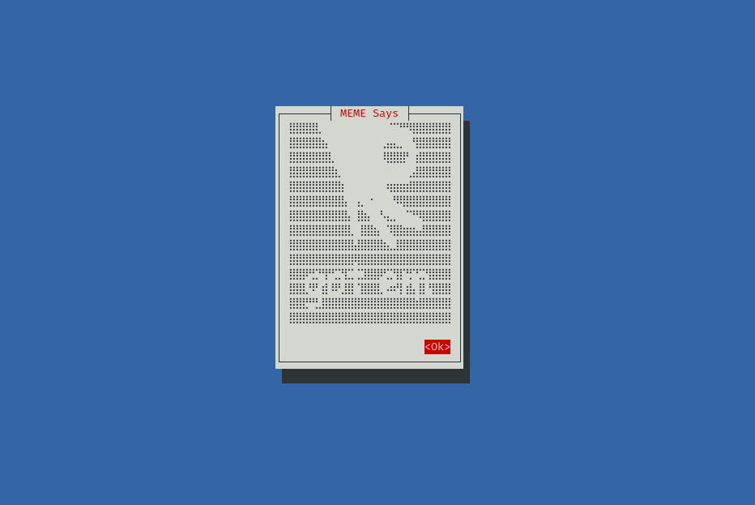

# TUI of Memesay



> it's a simple TUI app, nothing special.

## Install

[Documentation of Cursive](https://github.com/gyscos/cursive/wiki/Backends)

### Cursive on Linux

```bash
sudo apt install libncursesw5-dev
```

### Install Crusive on Win or Mac

- Windows and Mac [Instalation guide](https://github.com/gyscos/cursive/wiki/Backends)

## How to run it

```bash
cargo run
```
